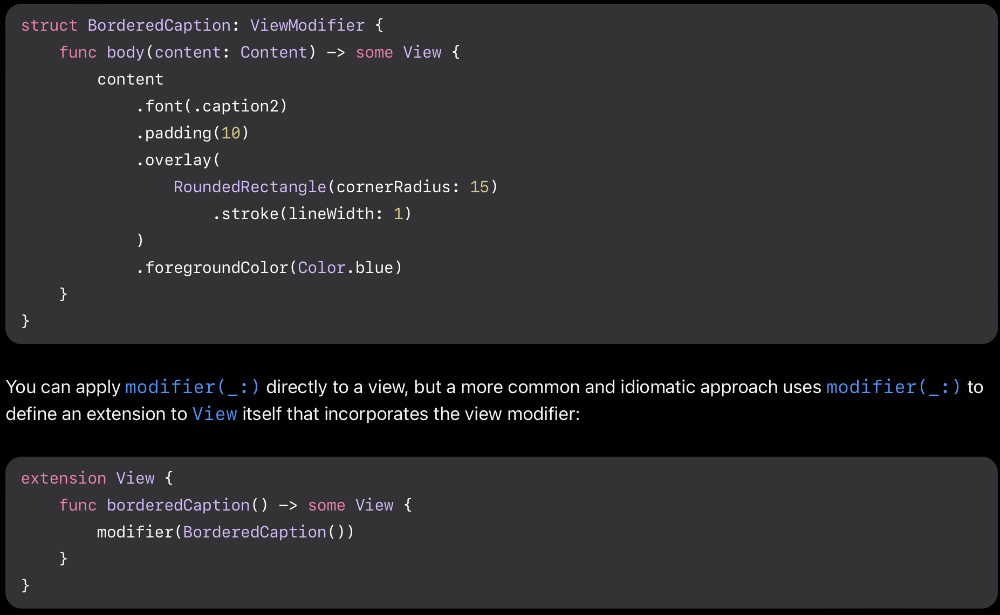

## 개요

---

- 스유는 크게 다음과 같은 구성요소를 갖는다
    - App, Scene, View(+ViewModifier, ViewBuilder)
        - 전부 프로토콜임(ViewBuilder는 제외)
    
    ```swift
    App {
      Scenes {
        Views {
          Views { }
        }
      }
    } 
    ```
   
<br><br>
 
- 각 구성요소들은 body에서 자신의 하위요소를 그리며 계층구조를 갖게 된다
    - App → Scene
    - Scene →  View
    - ParentView → ChildView…
   
<br><br>

- Scene을 채택하는 타입들은 크게 다음과 같다
    - WindowGroup
        - 기본값
        - (지원하는 경우) 다중 윈도우 → 멀티태스킹 O
        - 실제 윈도우가 만들어질때, 이닛의 뷰빌더를 탬플릿삼아 새로운 윈도우가 만들어짐
    - Window
        - 단일 윈도우 → 멀티 태스킹 X
        - macOS에서만 사용 가능
    - DocumentGroup
        - IO가 일어나는 문서앱의 경우에는 이걸 쓰라함
    
    ---
    
    - 그 외
        - every: Group, ModifiedContent
        - macOS: Settings, MenuBarExtra, Window
        - watchOS: WKNotificationScene
   
<br><br>

- ViewBuilder
    - @resultBulder를 따르는 구조체
    - SomeParentView {} 에서 `{}`가 뷰빌더.  말그대로 뷰를 만드는 타입
   
<br><br>
    
- ViewModifier
    - 프로토콜
    - ViewBuilder처럼 뷰를 만들긴 하는데, 기존의 뷰를 수정하며 새로운 뷰를 만드는 것
        
        
        
   
<br><br>

- View, ViewBuilder, ViewModifier
    
    ```swift
    ViewX(viewBuilder: {
    	ViewY()
    	ViewZ()
    }) 
      .viewModifier()
      .viewModifier()
      .viewModifier()
    ```
